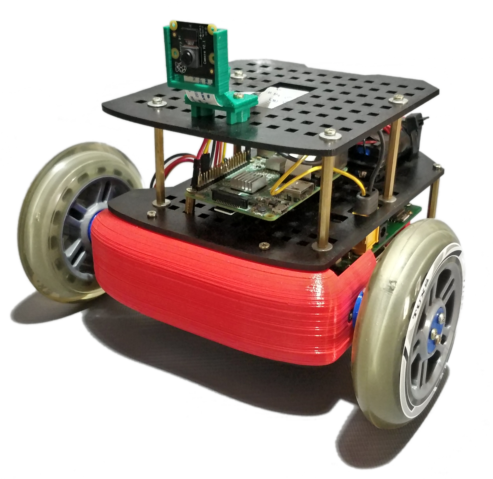
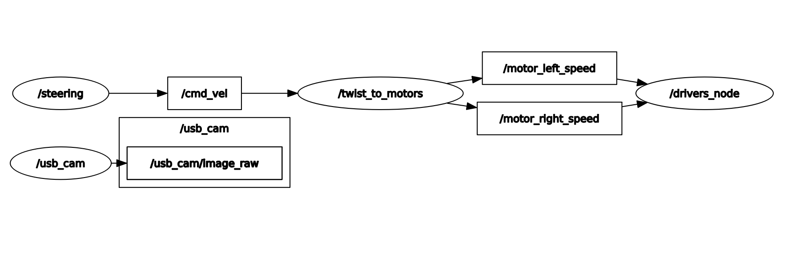

<p align="center">
  <a href="" rel="noopener">
 </a>
</p>

<h3 align="center">Noah Software</h3>

<div align="center">

[]()
[](/LICENSE)

</div>

---
This repo contains all the necessary ROS software for noah-robot.

## 📝 Table of Contents

- [📝 Table of Contents](#-table-of-contents)
- [About](#about)
- [Software](#software)
- [Videos](#videos)
- [Clone the repo](#clone-the-repo)
- [Authors](#authors)

## About

As a final thesis project of Electronics engineering, I decided to build a robot from scratch. All the design was made in order to build the robot with parts that can be bought in Argentina.

Take a look to the other repos related to this project:

- [noah-hardware](https://github.com/GonzaCerv/noah-hardware).
- [noah-docker](https://github.com/GonzaCerv/noah-docker).

## Software

 </a>

This repo contains some nodes that allows to teleop the robot from a PC. Just compile the project inside docker container in the robot and in your PC. Execute `roslaunch noah_behaviour roc.launch` in your PC and `roslaunch noah_behaviour robot.launch` in the robot. Take a look to the videos in order to see how it behaves. 

## Videos

- [Exploded view of the robot](https://youtu.be/NDaXydzkYNs)
- [Working demo of the robot](https://youtu.be/hgb2TbaiBBA)

## Clone the repo

Remember that this repo uses submodules
  
  ```bash
  git clone https://github.com/GonzaCerv/noah-software
  git submodule init
  git submodule update
  ```

## Authors

- [Gonzalo Cervetti](https://github.com/GonzaCerv) - Idea & Initial work
